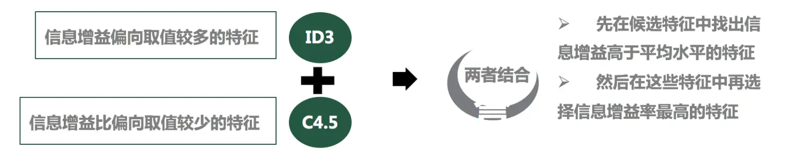

# 背景

**由于最近项目的需要，学习了分类算法--决策树，从逐步了解决策树，然后到手动在Excel里面模拟计算相关算法，最后到对scikit-learn库的运用，算是从理论到实践走了一遍，也发现scikit-learn库并不是完全对理论的实现，只是将部分算法实现出来，现总结分享出来供大家参考。**
<br/>
决策树大概的样子


# 决策树三个算法介绍
如果说对决策树比较熟悉的话，发展到现在主要有三个决策树算法，ID3、C4.5、CART这三个算法，其中ID3是利用信息增益，C4.5利用信息增益率，CATR利用基尼系数，C4.5是对ID3缺点的一个改进，但改进后还是有缺点，现在目前运用较多的是基尼系数，也就是CART这个算法，scikit-learn库里面的决策树默认的就是运用基尼系数来进行分枝。


#### ID3--信息增益
信息增益也就是信息熵的差值，也就是通过一个节点分枝使信息熵减少了多少，信息熵是由香农提出的，相信大家都听说过这个大人物，那什么是信息熵呢，看了很多参考书，感觉解释的最通俗易懂的是吴军的《数学之美》里面对这个概念的阐述。


信息熵的主要公式：

信息增益是在条件熵下计算而来，类似于条件概率的意思

ID3算法过程：


#### C4.5--信息增益率
说白了就是相对于信息增益多了一个比值，由于信息增益更倾向于分类比较多的属性，这个大家可能比较懵，详细解释一下，比如说一个变量(一个特征)A，是个分类变量，它下面包含A1,A2,A3三个不同的属性（水平），而另外一个变量B下面包含B1,B2,B3,......,B10共10个不同的属性，那么计算出来的信息增益，根据历史经验来说，变量B信息增益比较大，一般首先选取B来作为节点进行分枝。
而C4.5就是克服这个缺点应运而生，就是再用计算出来的这个信息增益除以这个变量本来的信息熵

信息增益率主要公式：

#### ID3与C4.5结合使用效果相对比较好


#### scikit-learn库对信息增益的实现大概框架
scikit-learn库里面的决策树，没有具体说是信息增益，还是信息增益率，这个有兴趣可以仔细研究一下[https://scikit-learn.org/stable/modules/generated/sklearn.tree.DecisionTreeClassifier.html#sklearn.tree.DecisionTreeClassifier](https://scikit-learn.org/stable/modules/generated/sklearn.tree.DecisionTreeClassifier.html#sklearn.tree.DecisionTreeClassifier)

```python
from sklearn import tree    # 导入决策树库

# 训练分类模型
model_tree = tree.DecisionTreeClassifier(criterion='entropy',random_state=0)  
# 建立决策树模型对象，需要指定criterion为entropy

model_tree.fit(X, y)   #对数据进行训练

feature_importance = model_tree.feature_importances_    # 指标重要性
```
模型效果可视化需要用到其他的库及软件，这里不再详述，可参考其他内容，**主要点就是中文的显示问题，中文是可以显示的，相关文档也有介绍，大家也可以仔细研究**

#### CART (Classification And Regression Tree) 分类回归树


**解释一下“纯”：在我的印象里这个字是形容女生的，怎么跑到这里来呢，呵呵，这里的纯是说，经过一个节点的分枝后，目标变量y里面都是一个类别的，就说是纯的，不纯，就是经过一个节点的分枝后，目标变量y里面还是比较乱，任然不能确定目标属于哪个类别**

#### scikit-learn库对基尼系数的实现大概框架
```python
from sklearn import tree    # 导入决策树库

# 训练分类模型
model_tree = tree.DecisionTreeClassifier(criterion='gini',random_state=0)  
# 建立决策树模型对象，需要指定criterion为gini，也可以不指定，默认的就是gini

model_tree.fit(X, y)   #对数据进行训练

feature_importance = model_tree.feature_importances_    # 指标重要性
```
#### 模型可视化中文显示问题
需要把里面的字体替换为微软雅黑即可

```python
names_list=['中文1','中文2','中文3',...]

tree.export_graphviz(model_tree,out_file=dot_data,feature_names=names_list, filled=True,rounded=True,special_characters=True)

graph4 = graphviz.Source(dot_data.getvalue().replace('helvetica','"Microsoft YaHei"'))
graph4.render('决策树-5组均分-2变量') #生成PDF文件
```
# 参考
1. [https://www.cnblogs.com/muzixi/p/6566803.html](https://www.cnblogs.com/muzixi/p/6566803.html)
2. [https://www.jianshu.com/p/35129fae39f6](https://www.jianshu.com/p/35129fae39f6)

**************************************************************************
**以上是自己实践中遇到的一些问题，分享出来供大家参考学习，欢迎关注微信公众号：DataShare ，不定期分享干货**

