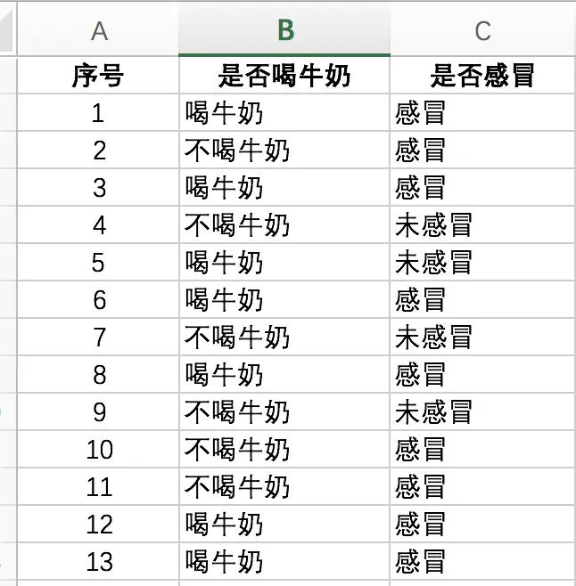
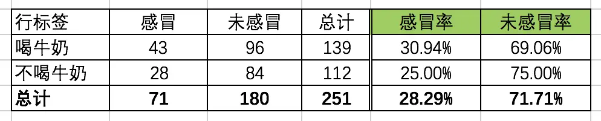
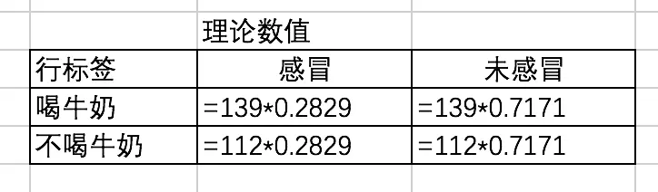
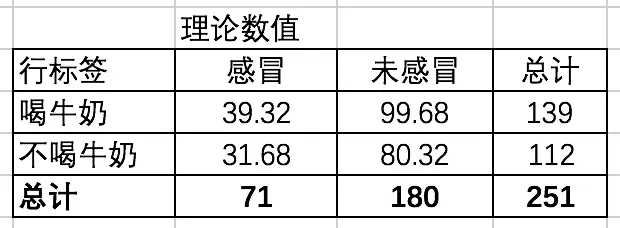
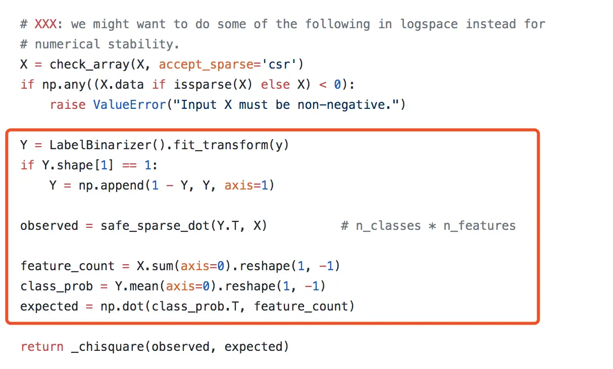
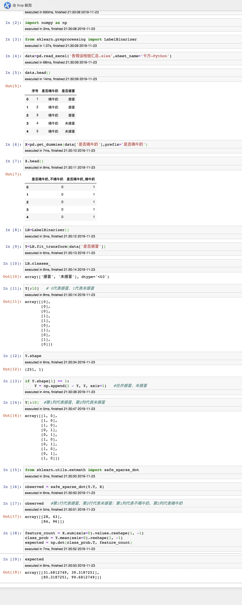
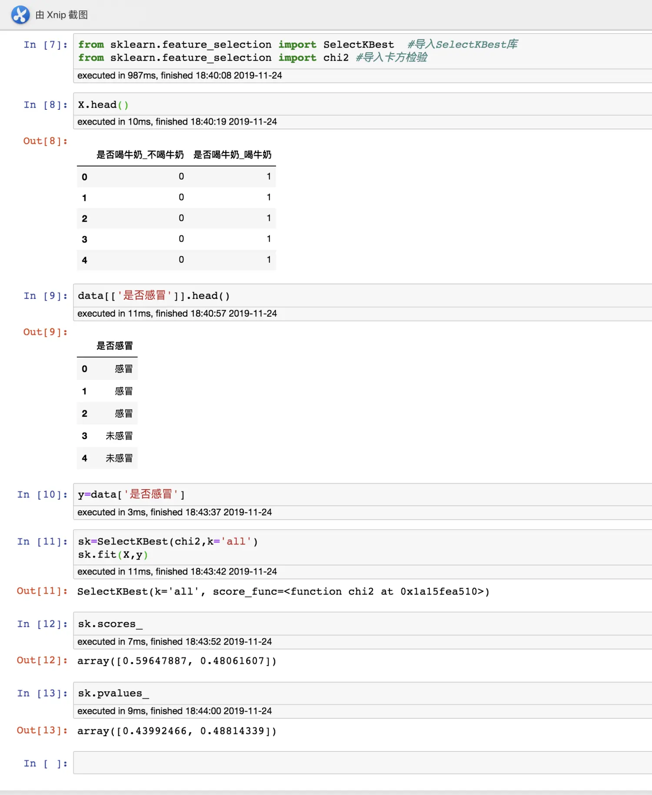

# 统计里面的卡方检验
卡方检验主要是用来进行 **分类变量（离散变量）** 的关联性、相关性分析，其根本思想就是在于比较理论频数和实际频数的吻合程度或拟合优度问题。

在统计学里面最经典就是四方格检验，下面列举一个例子，让大家对卡方检验有一个真实的认识：
现在我们有一些样本，每个人是否喝牛奶，以及是否感冒，形式如下（只截图了一部分），现在我们想知道，**是否喝牛奶** 对 **是否感冒**有影响，根据我们的常识判断，喝牛奶可以增强体质，有助于抵抗感冒，但一切结论都要有依据，才能使大家信服，于是这就用到统计学里面的卡方检验。



根据上面的数据，我们可以在Excel里面创建透视表，形成一个交叉表（列联表），统计交叉后的频数及占比情况，喝牛奶这一行的感冒率是用感冒的人数43除以喝牛奶总人数139，其他同理，如下所示：



通过简单的统计我们得出喝牛奶和不喝牛奶的感冒率为30.94%和25.00%，两者的差别可能是抽样误差导致，也有可能是牛奶对感冒真的有影响。

**先建立假设：
H0（原假设）：是否喝牛奶与是否感冒独立无关
H1（备择假设）：是否喝牛奶与是否感冒是相关的，也就是喝牛奶会影响到感冒**

为了确定真实原因，我们先假设喝牛奶对感冒是没有影响的，即喝牛奶和感冒是独立无关的，所以我们可以得出感冒的发病率实际是（43+28）/（43+28+96+84）= 28.29%

所以，理论上的数值如下表所示：


即下表数据：

卡方检验的公式为：


**根据卡方检验公式我们可以得的卡方值为：
卡方 = (43 - 39.32)^2 / 39.32 + (28 - 31.68)^2 / 31.68 + (96 - 99.68)^2 / 99.68 + (84 - 80.32)^2 / 80.32 = 1.077**

根据自由度和检验显著性水平0.05，通过查卡方表，可以得到对应的卡方值为3.84，即如果卡方大于3.84，则认为喝牛奶和感冒有95%的概率相关。显然1.077<3.84，没有达到卡方分布的临界值，**原假设成立，即是否喝牛奶和是否感冒独立无关，其实通过公式也可以理解。**

**自由度等于= (行数 - 1) * (列数 - 1)，对四格表，自由度= 1**

**********************************************************************************
通过上面的例子，大家应该对卡方检验有了深入理解，但是这个在机器学习sklearn库里面是怎么用的呢，以及用时我们应该怎么输入数据，上面例子我们是通过交叉表进行计算的，那么sklearn库又是怎么计算的呢？下面通过读官方的原始代码一步一步进行分析
# 官方原始代码
- github地址：[https://github.com/scikit-learn/scikit-learn/blob/1495f6924/sklearn/feature_selection/univariate_selection.py#L172](https://github.com/scikit-learn/scikit-learn/blob/1495f6924/sklearn/feature_selection/univariate_selection.py#L172)
- 官方chi2函数主要截图，def chi2(X, y)，红框里面是主要的代码，其他基本都是很好理解，红框上面的是对输入的x进行类型检查：



# 下面一句一句对官方原始代码进行解析
```python
Y = LabelBinarizer().fit_transform(y)

if Y.shape[1] == 1:
        Y = np.append(1 - Y, Y, axis=1)
```
- 对输入的y进行二值化处理，也就是对y里面的类别进行数值处理，形成一列数值，用1和0进行表示不同的两个类别，LabelBinarizer()对超过两个类别也能处理，类似和one-hot编码
- 下面的if 是为了添加另一个类别，假如y里面只有两个类别的话，那么进行二值化处理后Y就只有1列，也就是只能表示y里面的一个类别，另外一个类别需要再添加上，新加的一列其实也就是对刚才二值化的数据取反
- 通过上面的理解，在输入y时可以是字符型，也可以是数值型，在机器学习里面大家印象一般都是用数值型数据，但是在这一块可以用字符型，像咱们的汉字等
*************************
```python
observed = safe_sparse_dot(Y.T, X)          # n_classes * n_features
```
- observed意思是观察值，也就是对应卡方里面的真实值，那么这行意思就是求真实值，只不过是用矩阵的乘法来处理
- 输入的X只能是数值型，这一块是用来进行矩阵乘法，那么也就是输入的分类变量必须处理成数值，需要用到one-hot，对每一个分类变量（离散变量）进行转换，**这一块千万不能用 1 代表类别1， 2 代表类别2， 3 代表类别3 等，否则卡方检验就是错的，所选的特征同样也是错的**，如果分类变量里面只有两个类别的话，可以直接用1，0
- Y.T 与 X两个矩阵的乘法，结果为y里面每个类别的计数
***********************
```python
feature_count = X.sum(axis=0).reshape(1, -1)
class_prob = Y.mean(axis=0).reshape(1, -1)
expected = np.dot(class_prob.T, feature_count)
```
- 这三句代码是用来求理论数值，首先求出X矩阵每列求和，然后求出Y矩阵里面每个类别的占比（1的个数/总样本，其实也就是直接求平均，为理论占比），最后进行矩阵乘法，求出理论数值
***************************
```python
return _chisquare(observed, expected)
```
- 用计算卡方的函数传入真实值、理论值，计算出卡方值
****************************
# 下面利用上面的原始代码演示一遍

可以看出这个数值和上面Excel模拟的数值完全一样，最后通过卡方计算函数传入真实值、理论值即可求出  “**卡方值**”
*******************************
# 但是，但是，但是 求出来的卡方值，并不是统计上的卡方值、P值
在sklearn.feature_selection中，用到chi2时，在fit时需要传入X、y，**计算出来的卡方值是 单个特征变量对目标变量y的卡方值**，下面从大家经常使用api的角度去展示上面是否喝牛奶与是否感冒的特征筛选过程

```python
sk.scores_
# array([0.59647887, 0.48061607])

sk.pvalues_
# array([0.43992466, 0.48814339])
```
可以看出计算出来两列值为0.59647887、0.48061607，这是X单个特征变量对目标变量y的卡方值，并不是上面Excel模拟计算的卡方值为1.077

而0.59647887+0.48061607=1.077，这个才是真正意义上的卡方检验的卡方值，那么对应的P值同样也不是统计意义上的P值

**所以在sklearn.feature_selection.SelectKBest中基于卡方chi2，提取出来的比较好的特征变量，可以理解为在所有特征变量里面相对更好的特征，并不是统计里面分类变量与目标变量通过卡方检验得出的是否相关的结果，因此大家在进行特征筛选用到这个api时，要有真实的理解，感觉这点比较重要，分享出来供大家参考**

******************************
**以上是自己实践中遇到的一些点，分享出来供大家参考学习，欢迎关注本简书号**
