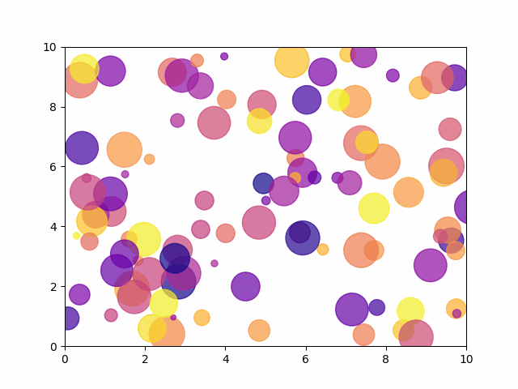
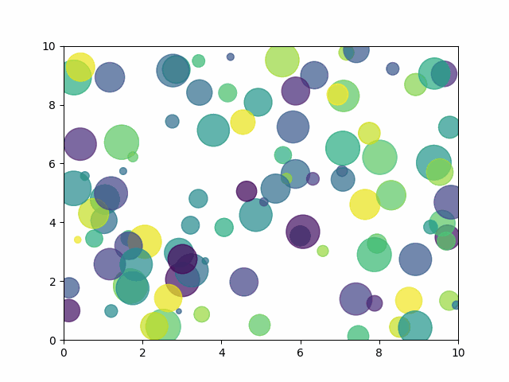

# 背景
一图胜千言，优秀的可视化图表不仅能以直观、简洁的方式呈现复杂的信息，还能够通过图形、颜色和布局的巧妙设计，引发观众的情感共鸣，增强数据背后故事的表达力与说服力。它们超越了单纯的数据展示，更能帮助观众深入理解潜在的趋势、关系和模式，从而更有效地支持决策和行动

# 小编环境
```python
import sys
print('python 版本：',sys.version)
#python 版本： 3.11.11 | packaged by Anaconda, Inc. | 
#(main, Dec 11 2024, 16:34:19) [MSC v.1929 64 bit (AMD64)]

import matplotlib
print(matplotlib.__version__)
#3.10.0

import numpy
print(numpy.__version__)
#2.2.2
```
# 效果展示




# 完整代码
```python
#导入库
import matplotlib.pyplot as plt
import matplotlib.animation as animation
import numpy as np

#生成数据
num_points = 100
x,y = np.random.rand(2,num_points)*10

#生成颜色和大小数据
colors = np.random.rand(num_points)
sizes =np.random.rand(num_points)*1000

#创建图形和散点图
fig, ax = plt.subplots()
scat =ax.scatter(x,y,c=colors,s=sizes, alpha=0.7, cmap='plasma') #viridis
ax.set_xlim(0,10)
ax.set_ylim(0,10)

#创建动画更新函数
def animate(i):
    new_x=x+np.random.randn(num_points)*0.1
    new_y=y+np.random.randn(num_points)*0.1
    scat.set_offsets(np.c_[new_x,new_y])  #更新散点图中所有点的坐标
    return scat,

ani = animation.FuncAnimation(fig,animate,frames=100,interval=150)
ani.save('plasma.gif', writer='pillow', fps=10) #viridis
```
这里重点是创建动画更新函数 `animate`，用于更新每一帧散点图中的点的位置，传入的参数 `i` 代表帧编号参数，是 `FuncAnimation` 每次调用更新函数时传入的参数，表示当前动画帧的索引

# 历史相关文章
- [Python 基于plotly库快速画旭日图](./Python-基于plotly库快速画旭日图.md)
- [Python 利用Matplotlib制作初中时圆规画的图](./Python-利用Matplotlib制作初中时圆规画的图.md)
- [Matplotlib 自定义函数实现左边柱形图，右边饼图](./Matplotlib-自定义函数实现左边柱形图，右边饼图.md)

**************************************************************************
**以上是自己实践中遇到的一些问题，分享出来供大家参考学习，欢迎关注微信公众号：DataShare ，不定期分享干货**
