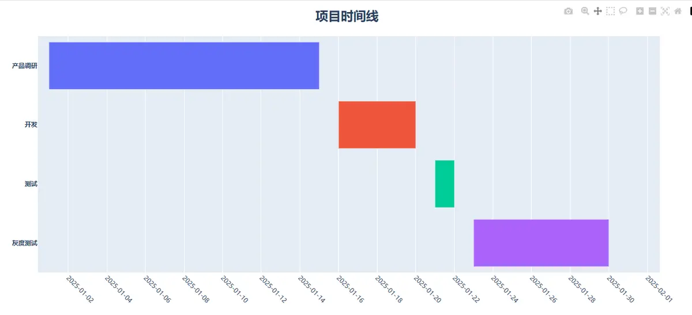

# 背景
本文借助 **plotly** 库来绘制时间线图，该库是一个高级可视化库，相对 Matplotlib 更高级一些，上手相对比较容易

- 低阶API：Plotly Graph Objects(go)
- 高阶API：Plotly Express(px)

# 小编环境
```python
import sys
import plotly
import pandas as pd

print('python 版本：',sys.version.split('|')[0])
#python 版本： 3.11.11

print("plotly 版本:",plotly.__version__)
#plotly 版本: 5.24.1

print("pandas 版本:", pd.__version__)
#pandas 版本: 2.2.2
```
# 时间线图效果


# 完整代码
```python
import plotly.express as px 
import pandas as pd
import plotly.io as pio
pio.renderers.default = "browser"  # 设置默认渲染器为浏览器

#创建模拟数据
df = pd.DataFrame([
    dict(Task='产品调研',Start='2025-01-01',Finish='2025-01-15'),
    dict(Task='开发',Start='2025-01-16',Finish='2025-01-20'),
    dict(Task='测试',Start='2025-01-21',Finish='2025-01-22'),
    dict(Task='灰度测试',Start='2025-01-23',Finish='2025-01-30')
]
)

#画图
fig=px.timeline(
    df,
    x_start='Start',
    x_end='Finish',
    y='Task',
    color='Task'
)

# 设置全局字体为微软雅黑
fig.update_layout(
    font_family="Microsoft YaHei",  # 设置全局字体家族
    showlegend=False,               # 隐藏图例
    title_text='项目时间线',         # 图表标题
    title_font_size=24,             # 标题字体大小
    title_x=0.5,
    title_font_weight='bold',
    xaxis_tickfont_size=16,  # X轴刻度标签字体大小
    # xaxis_tickfont_weight='bold',
    yaxis_tickfont_weight='bold',
)


# fig.update_yaxes(autorange='reversed')  #y轴翻转显示
fig.update_yaxes(title_text='')

# 精细控制X轴（日期轴）的显示
fig.update_xaxes(
    tickmode='auto',                # 让Plotly自动选择刻度位置，但我们会规定格式
    tickformat='%Y-%m-%d',          # 设置x轴日期格式为 yyyy-MM-dd
    nticks=20,                      # 建议显示的刻度数量（Plotly可能不会完全遵守）
    tickangle=45,                   # 刻度标签旋转45度，避免重叠
    tickfont_size=12,               # 刻度标签的字体大小
)

fig.show()
```
# 历史相关文章
- [Python 基于plotly库快速画旭日图](./Python-基于plotly库快速画旭日图.md)
- [Python 基于Matplotlib制作动态图](./Python-基于Matplotlib制作动态图.md)
- [Matplotlib 自定义函数实现左边柱形图，右边饼图](./Matplotlib-自定义函数实现左边柱形图，右边饼图.md)

**************************************************************************
**以上是自己实践中遇到的一些问题，分享出来供大家参考学习，欢迎关注微信公众号：DataShare ，不定期分享干货**
