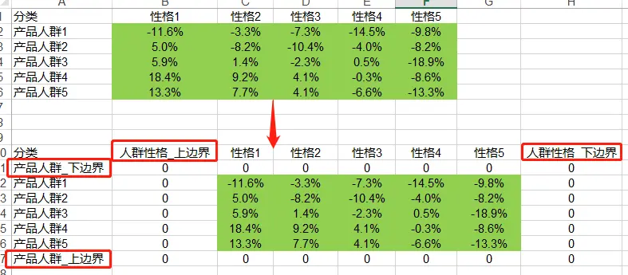
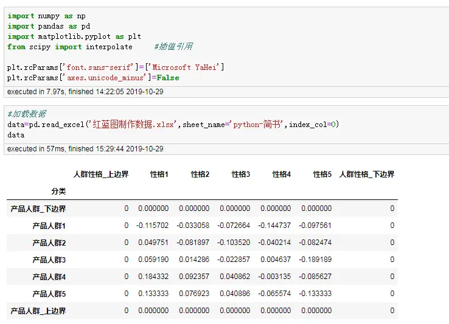
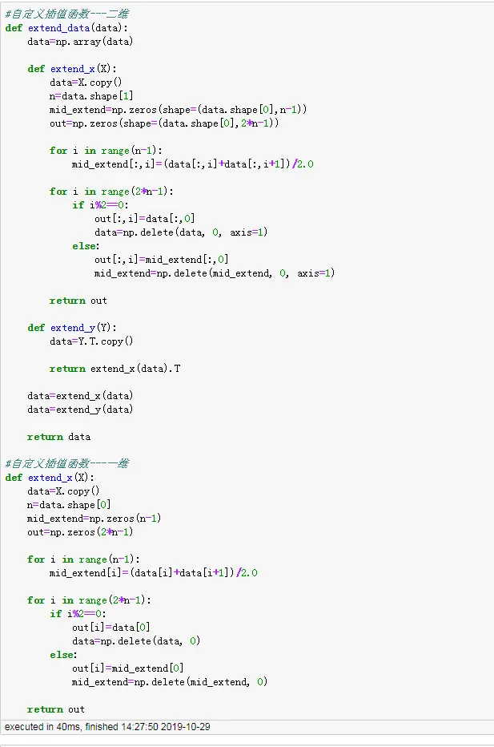
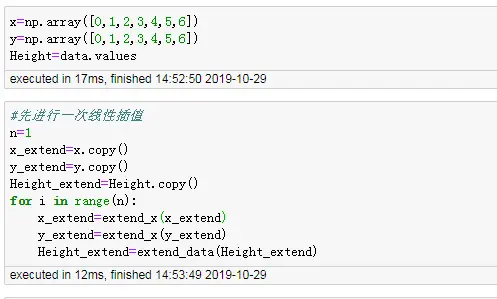
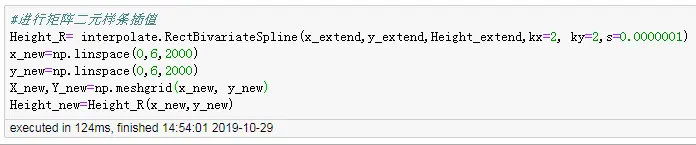
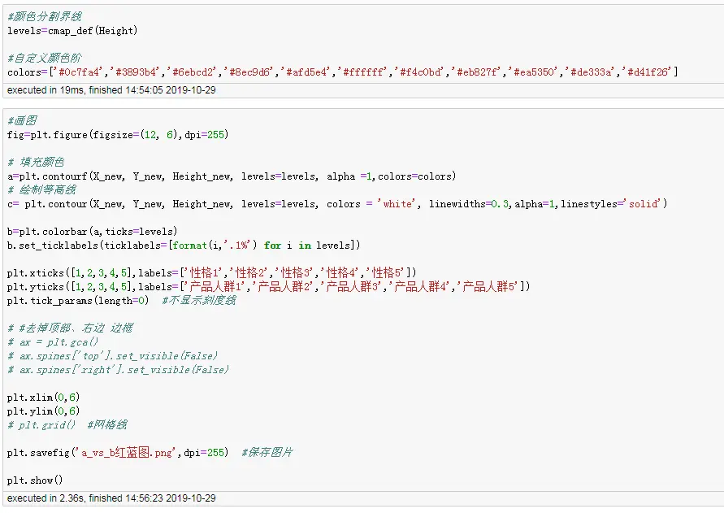
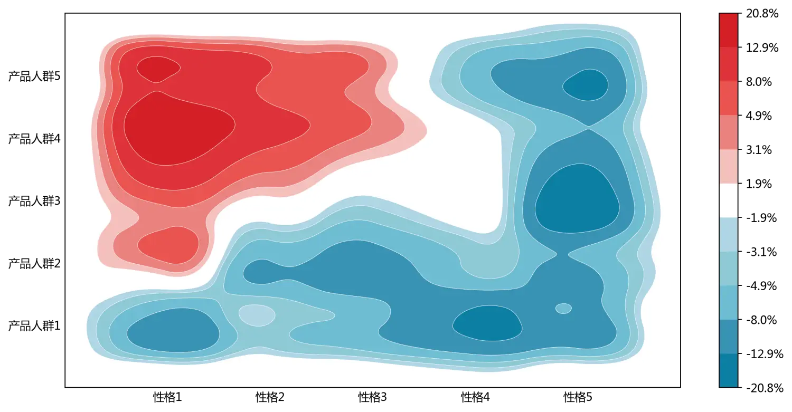

# 背景
最近项目在写报告时需要用到罗兰贝格图进行数据可视化呈现，罗兰贝格图如下所示，是用红色代表相对更强的方面，蓝色代表相对比较弱的方面，比如两个品牌在对比时，A品牌与B品牌，A品牌在哪些方面更有优势，在哪些方便相对比较薄弱。通过罗兰贝格图可以给人直观的印象，可视化出来能够使客户一眼判断出来。


# Python等高线图
罗兰贝格图放在Python里面对应就是等高线图，等高线图在matplotlib库里面对应plt.contourf函数与plt.contour函数，熟悉里面的参数后基本都可以进行画图，由于我们的数据是一个表格（矩阵），只有对应的几个点，要想画出这种不规则的图，只能利用插值方法进行处理，然后需要把图形转换成平滑的形状。

**遇到的难点：** <br/>
1. 0应该为白色，需要用来区分红色和蓝色，在画图时需要用自定义函数来处理
2. 画的图要进行平滑处理，需要利用矩阵二次样条插值法


下面一步一步进行介绍：

- **1、添加上下边界** <br/>
这个需要在Excel里面手动进行处理，放在python中也是可以处理，但是相对来说Excel里面更灵活，后面可以直接进行读取数据，然后画图。目的主要用来画图时，图的周边是白色


- **2、读取数据** <br/>
从Excel文件里面读取数据


- **3、自定义插值函数** <br/>
这里面用的是线性插值，在两个点中间插入一个新的点，新点的值为两边点的均值：$新点值x=\frac{a+b}{2}$，下面一共自定义两个，一个是用来对二维数据进行插值处理，一个是用来对一维数据进行插值


- **4、自定义颜色分割界线函数** <br/>
主要用来规避等高线图里面自带的cmp参数的缺点，使0值作为红色与蓝色的对称中心，使红色分为5个区间，蓝色分为5个区间。这个自定义函数里面`progression`参数可以选择用等差还是等比来分割，默认的是等比，画图结果相对更美观一些


- **5、定义坐标点** <br/>
定义坐标点后，并利用上面自定义的插值函数对x、y、Height各进行一次线性插值

- **6、进行平滑处理** <br/>
运用scipy库里面的矩阵样条插值函数进行平滑度处理，详细参数含义可以查看官方文档https://docs.scipy.org/doc/scipy/reference/generated/scipy.interpolate.RectBivariateSpline.html#scipy.interpolate.RectBivariateSpline



- **7、画图** <br/>
首先需要用到上面自定义的颜色分割界线函数计算一下分割界线，然后剩下的和正常的画图一样

- **8、最终结果** <br/>


# 以上为整个罗兰贝格的画图步骤，下面展示全部的详细代码：
```python
import numpy as np
import pandas as pd
import matplotlib.pyplot as plt
from scipy import interpolate     #插值引用

plt.rcParams['font.sans-serif']=['Microsoft YaHei']
plt.rcParams['axes.unicode_minus']=False

#加载数据
data=pd.read_excel('红蓝图制作数据.xlsx',sheet_name='python-简书',index_col=0)
data

#自定义插值函数---二维
def extend_data(data):
    data=np.array(data)
    
    def extend_x(X):
        data=X.copy()
        n=data.shape[1]
        mid_extend=np.zeros(shape=(data.shape[0],n-1))
        out=np.zeros(shape=(data.shape[0],2*n-1))

        for i in range(n-1):
            mid_extend[:,i]=(data[:,i]+data[:,i+1])/2.0

        for i in range(2*n-1):
            if i%2==0:
                out[:,i]=data[:,0]
                data=np.delete(data, 0, axis=1)
            else:
                out[:,i]=mid_extend[:,0]
                mid_extend=np.delete(mid_extend, 0, axis=1)

        return out
    
    def extend_y(Y):
        data=Y.T.copy()

        return extend_x(data).T
    
    data=extend_x(data)
    data=extend_y(data)
    
    return data

#自定义插值函数---一维
def extend_x(X):
    data=X.copy()
    n=data.shape[0]
    mid_extend=np.zeros(n-1)
    out=np.zeros(2*n-1)

    for i in range(n-1):
        mid_extend[i]=(data[i]+data[i+1])/2.0

    for i in range(2*n-1):
        if i%2==0:
            out[i]=data[0]
            data=np.delete(data, 0)
        else:
            out[i]=mid_extend[0]
            mid_extend=np.delete(mid_extend, 0)

    return out

#自定义颜色分割界线
def cmap_def(Height,progression='logspace'):
    '''
    white_min  白色下界
    white_max  白色上界，与白色下界对称
    n          在extend_Height最大值与白色上界等分的数量
    progression  'logspace' 等差数列   'logspace'等比数列
    
    返回：levels
    '''
    white_min=-1*np.max(np.abs(Height))/10     #白色下界
    white_max=1*np.max(np.abs(Height))/10      #白色上界，与白色下界对称
    n=6      #在Height最大值与白色上界等分的数量
    
    Height_max=np.max(np.abs(Height))+np.max(np.abs(Height))/10
    
    if progression=='linspace':         #线性等差分割点
        
        levels=list(np.linspace(-1*Height_max,white_min,n))   #小于白色下界值等分n

        levels.extend(list(np.linspace(white_max,Height_max,n)))
    
    else :    #等比分割点
        levels=-1*np.logspace(np.log(white_max),np.log(Height_max),n,base=np.e)
        levels.sort()
        levels=list(levels)
        levels.extend(list(np.logspace(np.log(white_max),np.log(Height_max),n,base=np.e)))
    
    return levels

x=np.array([0,1,2,3,4,5,6])
y=np.array([0,1,2,3,4,5,6])
Height=data.values
#先进行一次线性插值
n=1
x_extend=x.copy()
y_extend=y.copy()
Height_extend=Height.copy()
for i in range(n):
    x_extend=extend_x(x_extend)
    y_extend=extend_x(y_extend)
    Height_extend=extend_data(Height_extend)

#进行矩阵二元样条插值
Height_R= interpolate.RectBivariateSpline(x_extend,y_extend,Height_extend,kx=2, ky=2,s=0.0000001)
x_new=np.linspace(0,6,2000)
y_new=np.linspace(0,6,2000)
X_new,Y_new=np.meshgrid(x_new, y_new)
Height_new=Height_R(x_new,y_new)

#颜色分割界线
levels=cmap_def(Height)

#自定义颜色阶
colors=['#0c7fa4','#3893b4','#6ebcd2','#8ec9d6','#afd5e4','#ffffff','#f4c0bd','#eb827f','#ea5350','#de333a','#d41f26']

#画图
fig=plt.figure(figsize=(12, 6),dpi=255)

# 填充颜色
a=plt.contourf(X_new, Y_new, Height_new, levels=levels, alpha =1,colors=colors)
# 绘制等高线
c= plt.contour(X_new, Y_new, Height_new, levels=levels, colors = 'white', linewidths=0.3,alpha=1,linestyles='solid')

b=plt.colorbar(a,ticks=levels)
b.set_ticklabels(ticklabels=[format(i,'.1%') for i in levels])

plt.xticks([1,2,3,4,5],labels=['性格1','性格2','性格3','性格4','性格5'])
plt.yticks([1,2,3,4,5],labels=['产品人群1','产品人群2','产品人群3','产品人群4','产品人群5'])
plt.tick_params(length=0)  #不显示刻度线

# #去掉顶部、右边 边框
# ax = plt.gca()
# ax.spines['top'].set_visible(False)
# ax.spines['right'].set_visible(False)

plt.xlim(0,6)
plt.ylim(0,6)
# plt.grid()  #网格线

plt.savefig('a_vs_b红蓝图.png',dpi=255)  #保存图片

plt.show()
```

*******
**以上是自己实践中遇到的一些点，分享出来供大家参考学习，欢迎关注本简书号**
