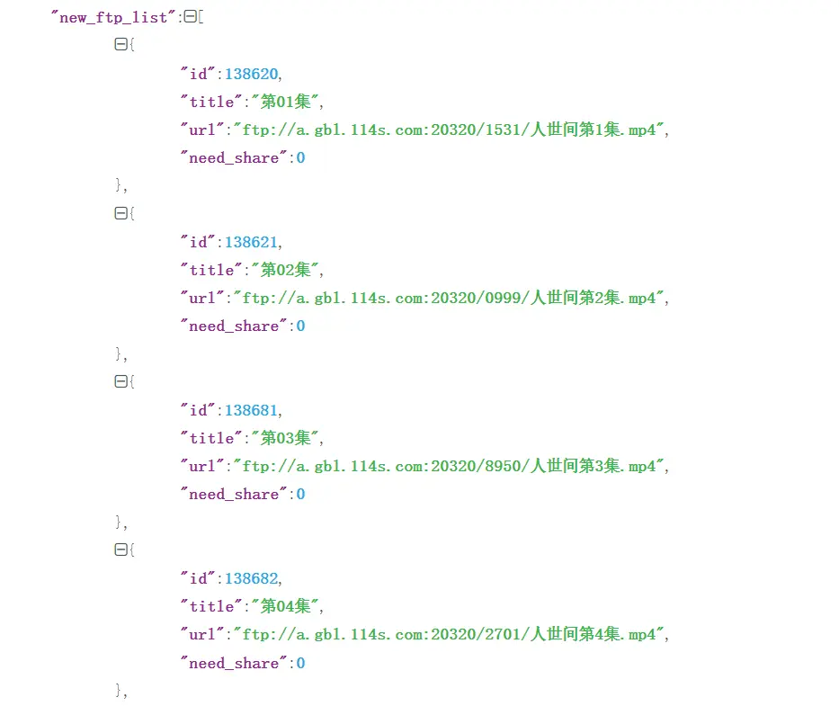

><p style="font-family: 'Microsoft YaHei', sans-serif; line-height: 1.5;">
>作者：数据人阿多
></p>

>**声明：**
>
>本篇文章仅用来技术分享，如有侵权请及时联系本小编，微信公众号：DataShare，进行删除

# 背景
一个用了十年的电影、电视剧网址：飘花电影网，https://www.piaohua.com，关键是一直免费，从大学时代到工作了几年后，仍一直在用的网站，里面的电影、电视剧一直实时更新，各大平台的VIP内容均可免费观看。


最开始是支持迅雷下载，后来迅雷会屏蔽下载链接，现在是网站自己开发一个 **荐片播放器** 可以直接用来边下载边观看，很是方便

***荐片播放器下载地址：https://www.jianpian8.com***


# 分析抓包内容
第一集：ftp://a.gbl.114s.com:20320/1531/人世间第1集.mp4

第二集：ftp://a.gbl.114s.com:20320/0999/人世间第2集.mp4

第三集：ftp://a.gbl.114s.com:20320/8950/人世间第3集.mp4

通过上面每一集的地址，可以发现 **a.gbl.114s.com** 这个服务器地址很牛逼，存放了这么多免费的电影、电视剧，于是通过国外一个搜索引擎找到了一个开放的API，可以查看播放地址

**API地址：https://api2.rinhome.com/api/node/detail?id=556881**




可以明确《人世间的》的 id 是 556881，于是脑洞大开，想从id=1开始到100万，采集一个完整的明细，包含电影、电视剧


# 完整代码
```python
import asyncio
import aiohttp
import random
import json
import time


urls=[(id,f'https://api2.rinhome.com/api/node/detail?id={id}') for id in range(1,1000000)]

# User-Agent
def randomheader():
    UA = [
        'Mozilla/5.0 (Windows NT 6.1; WOW64) AppleWebKit/537.36 (KHTML, like Gecko) Chrome/68.0.3440.106 Safari/537.36',
        'Mozilla/5.0 (Windows NT 6.1; WOW64) AppleWebKit/537.1 (KHTML, like Gecko) Chrome/22.0.1207.1 Safari/537.1',
        'Mozilla/5.0 (X11; CrOS i686 2268.111.0) AppleWebKit/536.11 (KHTML, like Gecko) Chrome/20.0.1132.57 Safari/536.11',
        'Mozilla/5.0 (Windows NT 6.1; WOW64) AppleWebKit/536.6 (KHTML, like Gecko) Chrome/20.0.1092.0 Safari/536.6',
        'Mozilla/5.0 (Windows NT 6.2) AppleWebKit/536.6 (KHTML, like Gecko) Chrome/20.0.1090.0 Safari/536.6',
        'Mozilla/5.0 (Windows NT 6.2; WOW64) AppleWebKit/537.1 (KHTML, like Gecko) Chrome/19.77.34.5 Safari/537.1',
        'Mozilla/5.0 (X11; Linux x86_64) AppleWebKit/536.5 (KHTML, like Gecko) Chrome/19.0.1084.9 Safari/536.5',
        'Mozilla/5.0 (Windows NT 6.0) AppleWebKit/536.5 (KHTML, like Gecko) Chrome/19.0.1084.36 Safari/536.5',
        'Mozilla/5.0 (Windows NT 6.1; WOW64) AppleWebKit/536.3 (KHTML, like Gecko) Chrome/19.0.1063.0 Safari/536.3',
        'Mozilla/5.0 (Windows NT 5.1) AppleWebKit/536.3 (KHTML, like Gecko) Chrome/19.0.1063.0 Safari/536.3',
        'Mozilla/5.0 (Macintosh; Intel Mac OS X 10_8_0) AppleWebKit/536.3 (KHTML, like Gecko) Chrome/19.0.1063.0 Safari/536.3',
        'Mozilla/5.0 (Windows NT 6.2) AppleWebKit/536.3 (KHTML, like Gecko) Chrome/19.0.1062.0 Safari/536.3',
        'Mozilla/5.0 (Windows NT 6.1; WOW64) AppleWebKit/536.3 (KHTML, like Gecko) Chrome/19.0.1062.0 Safari/536.3',
        'Mozilla/5.0 (Windows NT 6.2) AppleWebKit/536.3 (KHTML, like Gecko) Chrome/19.0.1061.1 Safari/536.3',
        'Mozilla/5.0 (Windows NT 6.1; WOW64) AppleWebKit/536.3 (KHTML, like Gecko) Chrome/19.0.1061.1 Safari/536.3',
        'Mozilla/5.0 (Windows NT 6.1) AppleWebKit/536.3 (KHTML, like Gecko) Chrome/19.0.1061.1 Safari/536.3',
        'Mozilla/5.0 (Windows NT 6.2) AppleWebKit/536.3 (KHTML, like Gecko) Chrome/19.0.1061.0 Safari/536.3',
        'Mozilla/5.0 (X11; Linux x86_64) AppleWebKit/535.24 (KHTML, like Gecko) Chrome/19.0.1055.1 Safari/535.24',
        'Mozilla/5.0 (Windows NT 6.2; WOW64) AppleWebKit/535.24 (KHTML, like Gecko) Chrome/19.0.1055.1 Safari/535.24',
        'Mozilla/5.0 (Windows NT 6.1; WOW64) AppleWebKit/537.36 (KHTML, like Gecko) Chrome/68.0.3440.106 Safari/537.36',
        'Mozilla/5.0 (Windows NT 10.0; Win64; x64) AppleWebKit/537.36 (KHTML, like Gecko) Chrome/99.0.4844.51 Safari/537.36'
        ]
    headers = {'user-agent': random.choice(UA)}
    headers[
        'accept'] = 'text/html,application/xhtml+xml,application/xml;q=0.9,image/avif,image/webp,image/apng,*/*;q=0.8,application/signed-exchange;v=b3;q=0.9'
    headers['accept-encoding'] = 'gzip, deflate, br'
    headers['accept-language'] = 'zh-CN,zh;q=0.9'
    headers['cache-control'] = 'max-age=0'
    headers['sec-ch-ua'] = '" Not A;Brand";v="99", "Chromium";v="99", "Google Chrome";v="99"'
    headers['sec-ch-ua-mobile'] = '?0'
    headers['sec-ch-ua-platform'] = '"Windows"'
    headers['sec-fetch-dest'] = 'document'
    headers['sec-fetch-mode'] = 'navigate'
    headers['upgrade-insecure-requests'] = '1'
    headers['sec-fetch-site'] = 'none'
    headers['sec-fetch-user'] = '?1'

    return headers

async def async_get_url(id,url,sem):
    async with sem:
        async with aiohttp.ClientSession() as session:
            #print(randomheader())
            async with session.get(url,headers=randomheader()) as r:
                print('正在采集：', url)
                html = await r.text()
                try:
                    text_json = json.loads(html)
                    if text_json['msg'] == '请求成功':
                        with open(f'./success-async/{id}.json', 'w', encoding='utf-8') as fp:
                            json.dump(text_json, fp, ensure_ascii=False, indent=4)
                    else:
                        with open(f'./fail-async/{id}.json', 'w', encoding='utf-8') as fp:
                            json.dump(text_json, fp, ensure_ascii=False, indent=4)
                except:
                    with open(f'./fail-async/{id}.json', 'w', encoding='utf-8') as fp:
                        fp.write(html)
                        
                        
if __name__=='__main__':
    start=time.time()

    sem = asyncio.Semaphore(300)   #协程并发任务量
    tasks = [async_get_url(id, url, sem) for id, url in urls]
    loop = asyncio.get_event_loop()
    loop.run_until_complete(asyncio.wait(tasks))
    loop.close()

    print(f'cost time: {time.time() - start}s')
```

# 历史相关文章
- [Python opencv一次读取视频里面多张视频帧](../Python图像处理/Python---opencv一次读取视频里面多张视频帧.md)
- [Python 多线程，真实使用代码](../Python数据处理/Python-多线程，真实使用代码.md)
**************************************************************************
**以上是自己实践中遇到的一些问题，分享出来供大家参考学习，欢迎关注微信公众号：DataShare ，不定期分享干货**
